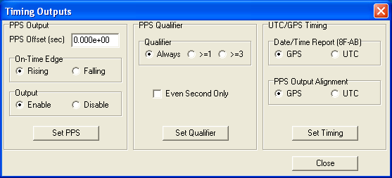
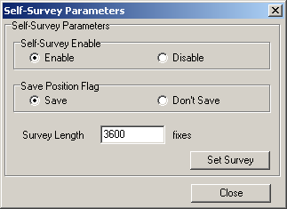
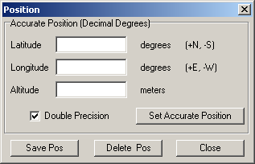
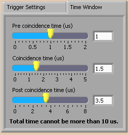
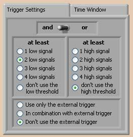
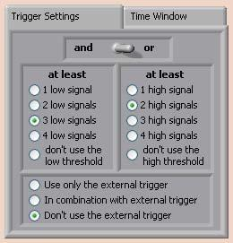

.. include:: subst.inc

Configuratie van de |hisparc| software
======================================

|hisparc| data acquisitie
-------------------------

Zodra de |hisparc| data acquisitie software opstart, zal hij vragen in
welke modus dat moet gebeuren.  Kies hier *Expert Mode*.  Zodra de
software vraagt om het invullen van het wachtwoord klikt u gewoon op *Ok*.

Basisinstellingen
^^^^^^^^^^^^^^^^^

.. note:: Als de |hisparc| kastjes nog niet zijn aangesloten, dan kunt u
   dat nu doen.

.. note:: Zorgt u ervoor dat bij het aansluiten van de kastjes op de pc de
   kastjes **uit** staan.  Dus eerst de USB kabels aansluiten, dan pas de
   voedingen.  Dit voorkomt een zeer storend probleem waarbij de kastjes
   al periodiek data verzenden naar de computer en Windows denkt dat het
   dan wel om een muis moet gaan.  Gevolg: de data van het kastje
   geïnterpreteerd als muis doet de muiscursor willekeurig over het scherm
   springen terwijl er van alles wordt opengeklikt of gesleept.

.. note:: Elke keer als u een instelling wijzigt wordt deze pas
   doorgevoerd wanneer u op *Apply Settings* klikt.  *Voor u dat doet,
   verandert er dus helemaal niets*.  Wanneer u wilt dat de instellingen
   behouden blijven na een herstart van het programma, klikt u op *Save
   settings*.

Het belangrijkste op dit moment is om de interne ADC's in te regelen,
anders zullen de kastjes alleen maar ruis lijken te geven.  Ga hiervoor
naar de *ADC alignment* tab en klik op *Start Alignment*.  Zodra het
proces klaar is (dit kan enige minuten duren) bevestigd u het opslaan van
de nieuwe instellingen.

Het volgende (dat vaak vergeten wordt) is om het stationnummer goed in te
vullen.  Ga hiervoor naar de *Expert Settings* tab en vul bij *Detector
Number* uw stationnummer in.

.. note:: Het kan verleidelijk zijn bij *Password* het stationwachtwoord
   in te vullen.  Dit is echter **niet** hetzelfde veld.  Het wachtwoord
   dat u hier kunt invullen mag geheel willekeurig zijn en is hetgeen
   gevraagd wordt bij het opstarten van *Expert Mode*.  In de meeste
   gevallen kunt u dit gewoon leeg laten.

Calibratie van de detector
^^^^^^^^^^^^^^^^^^^^^^^^^^

.. note:: Als de detectoren nog niet zijn aangesloten, kunt u dat nu doen.

Het is nu van belang de detectoren zelf in te regelen.  Hiervoor moet u de
juiste hoogspanning kiezen om op de fotobuizen te zetten.  Om dit te doen
hebben we een korte procedure opgesteld:

.. note:: Volg eerst de *volledige* procedure, inclusief het verhogen van
   de spanningen op de fotobuizen, voordat u resultaat verwacht.  Bij
   spanningen onder de 700 V ziet u gewoonlijk geen enkel signaal.  Maar
   volg de procedure nauwgezet en begin bij 300 V.

* Stel op de *Events / Settings* tab op het *Thresholds* tabje alle
  thresholds (drempelwaarden) in op -250 mV (voor de *Low* thresholds) en
  -300 mV (voor de *High* thresholds).
* Stel dan op het *Photomultiplier* tabje alle hoogspanningen in op 300 V.
* Ga naar de *Statistics (Trace & Trigger)* tab en kijk naar de *Last
  second* waarden in het *Singles* venster.  Daarin staat het aantal
  pulsen per seconde dat over de drempelwaardes ging.  Dat wil zeggen: bij
  *Channel 1 - low* staat het aantal pulsen per seconde dat de fotobuis
  van detector 1 zag die sterker waren dan -250 mV [#drempels]_.
* Voor een nauwkeurige bepaling van het gemiddelde aantal pulsen per
  seconde gebruikt u de timer functie in het midden van het scherm,
  onderaan.  U kijkt dan ook bij de singles in de laatste kolom, *Average
  per second*.
* Verhoog de spanningen op de fotobuizen nu zodanig dat bij alle *low
  thresholds* waarden staan tussen de 50 en de 60 (55), en bij alle *high
  thresholds* waarden tussen de 30 en de 40 (35).  Als de gemeten waarden
  te *laag* zijn, dan *verhoogt* u de spanningen en omgekeerd.  Maakt u
  bij het verhogen van de spanningen nooit grotere stappen dan 50 V om
  zeker te zijn dat de fotobuis niet beschadigd.

.. figure:: images/singles.png
   :align: center
   :scale: 100

   Het aantal pulsen per seconde dat over de drempelwaarden gaat
   (singles).

.. note:: Fotobuizen verschillen sterk van elkaar aangezien assemblage
   grotendeels een handmatig proces is.  De spanningen op de fotobuizen
   zijn vaak in de orde van 700 tot 1000 V.  Een gevoelige buis, die al
   bij 700 V goed werkt, kan gemakkelijk beschadigd raken wanneer hier
   1000 V op wordt gezet.  Weest u dus altijd voorzichtig en begin bij 300
   V en verhoog de spanningen nooit in grotere stappen dan 50 V.

GPS module
----------

Het |hisparc| *Master* kastje heeft een ingebouwde GPS module.  De
instellingen van de GPS worden in het kastje opgeslagen.  Het is
belangrijk om vóór gebruik de instellingen te controleren.  Verder moet
de GPS een zogenoemde *self survey* uitvoeren om de positie vast te leggen
zodat het mogelijk is de GPS als zeer nauwkeurig tijdinstrument te
gebruiken [#gpsmode]_.

Om het GPS monitor programma (*DSPMon*) te starten gaat u naar *Start ->
All Programs -> HiSPARC -> DSPMon*.  Waarschijnlijk staan na opstarten in
alle tekstvelden een vraagteken en zijn alle indicatielampjes grijs.
Rechts onderin het venster kunt u rechts-klikken op *No Com Port* en een
com-poort selecteren.  Er is er slechts één bij die werkt.

Controleert u eerst alle instellingen van de GPS en zorg ervoor dat ze
nauwkeurig overeenkomen met de volgende screenshots.  Mocht u een
instelling moeten veranderen, druk dan op de bijbehorende *Set* knop.

.. note:: In het verleden werkten we met UTC tijd.  Helaas introduceert
   UTC af en toe schrikkelseconden en is de tijd daardoor niet altijd
   eenduidig.  Voorts start de GPS module altijd op in GPS-tijd, om na een
   minuut over te schakelen naar UTC.  Daarom gebruiken we nu GPS-tijd.

.. note:: Let op: er komen soms meerdere *Set* knoppen per venster voor.

.. figure:: images/screenshot-gps-receiver.png
   :align: center
   :scale: 85

   In dit venster stelt u de opties in voor de GPS ontvanger.  De
   belangrijkste optie is hier de *Receiver Mode*.

   In dit venster stelt u de tijdsinstellingen in.  Het is zeer belangrijk
   om hier goed te controleren dat u *GPS* meet, en geen *UTC*-tijd.

   In dit venster zorgt u er voor dat de *self survey* lang genoeg duurt
   (één uur).

   Dit venster kan gebruikt worden om een eerste schatting van de positie
   in te vullen, maar let hier mee op dat deze niet wordt vastgezet als
   definitieve positie.  Het is veiliger om deze instellingen leeg te
   houden en de GPS zelf zijn positie te laten bepalen.

.. figure:: images/screenshot-gps-options.png
   :align: center
   :scale: 85

   De GPS kent vele opties waarvan een aantal door de |hisparc| software
   worden gebruikt.  Controleert u deze vinkjes goed.

Data acquisitie modus
---------------------

.. note:: U kunt de detector pas in gebruik nemen wanneer *alle*
   voorgaande procedures correct zijn uitgevoerd.

De definitieve instellingen voor *alle* |hisparc| detectorstations zijn
als volgt.

Time window instellingen
^^^^^^^^^^^^^^^^^^^^^^^^

Op de *Events / Settings* tab, klik op het tabje *Time Window*.  Als het
goed is zijn de instellingen niet veranderd en staan ze nog als volgt:

* Precoincidence time: 1 us
* Coincidence time: 1,5 us
* Post coincidence time: 3,5 us

   De instellingen voor het coïncidentie tijdvenster.

Opstelling met twee detectoren
^^^^^^^^^^^^^^^^^^^^^^^^^^^^^^

De instellingen voor stations met twee detectoren zijn als volgt:

* Threshold Low (alle kanalen): -30 mV
* Threshold High (alle kanalen): -70 mV
* Trigger: *2 low* **AND** *Don't use high threshold* **AND** *Don't use
  external trigger*

   De triggerinstellingen voor een detectorstation met twee detectoren.

Opstelling met vier detectoren
^^^^^^^^^^^^^^^^^^^^^^^^^^^^^^

De instellingen voor stations met vier detectoren zijn als volgt:

* Threshold Low (alle kanalen): -30 mV
* Threshold High (alle kanalen): -70 mV
* Trigger: *3 low* **OR** *2 high* **AND** *Don't use external trigger*

   De triggerinstellingen voor een detectorstation met vier detectoren.

Automatisch opstarten in DAQ modus
^^^^^^^^^^^^^^^^^^^^^^^^^^^^^^^^^^

Iedere keer als het programma is opgestart kunt u op de knop *Start DAQ
mode* klikken om over te gaan naar de data acquisitie modus.  *Alleen dan
wordt er daadwerkelijk data naar het Nikhef gestuurd!*

Om er voor te zorgen dat de detector na elke reboot automatisch opstart in
de data acquisitie modus gaat u naar de *Expert Settings* tab en vinkt
u *Start in DAQ mode* aan.

.. note:: Het is aan te bevelen de werking van de pc te testen door de pc
   nu opnieuw op te starten.  Als hij automatisch inlogt, het |hisparc|
   DAQ programma start en automatisch overgaat naar de DAQ modus, is het
   meeste werk gedaan.  Controleert u alstublieft in Nagios
   (:ref:`nagios-doc`) of uw detectorstation volledig functioneert.  Het
   kan ongeveer twintig minuten duren voordat Nagios volledig geupdate is.

.. rubric:: Footnotes

.. [#gpsmode] Meestal wordt een GPS gebruikt om zo nauwkeurig mogelijk de
   *positie* van de GPS te bepalen, ten behoeve van navigatie.  Wij willen
   echter zo nauwkeurig mogelijk de *tijd* van een |hisparc| event
   bepalen.  De positie beschouwen we hier als vast.  Het detectorstation
   verandert immers niet van plaats.  In deze zogeheten *Overdetermined
   clock mode* kan de GPS nauwkeurigheden bereiken in de orde van 15 ns.

.. [#drempels] De pulsen die de fotobuis (photomultiplier of PMT) afgeeft
   zijn negatief; het gaat hier immers om een stroom van elektronen.  Een
   *kleine* puls kan dan bijvoorbeeld -30 mV zijn, terwijl een *grote*
   puls bijvoorbeeld -500 mV kan zijn.  Als een drempel van -70 mV is
   ingesteld, dan zal de elektronica *wel* reageren op een puls van -100
   mV, maar *niet* op een puls van -50 mV.
