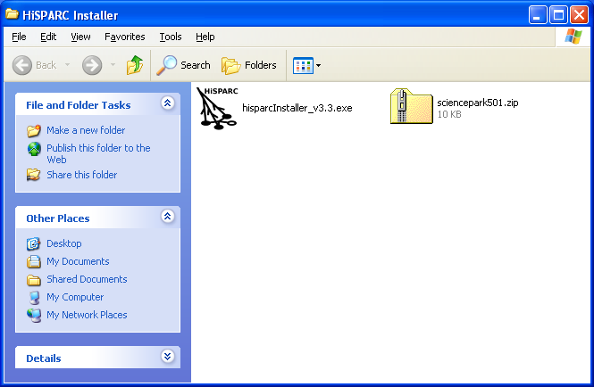
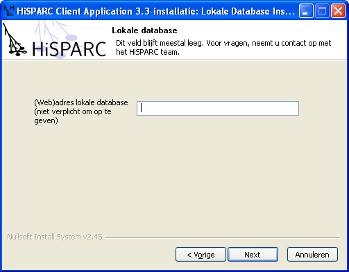
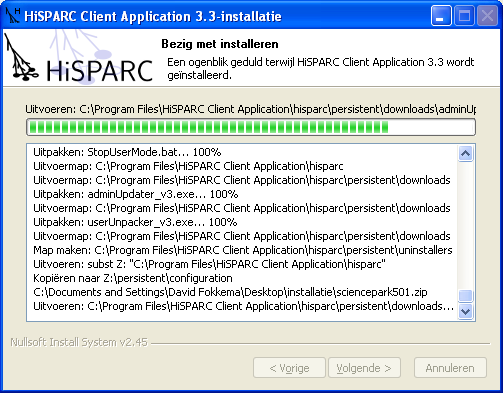
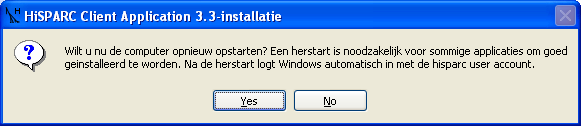

.. include:: subst.inc

Installatie
===========

De installatie van de |hisparc| software is recent zeer vereenvoudigd
[#ooti]_.  We maken nu gebruik van één installatiepakket dat alle
benodigde software op de |hisparc| detector pc's installeert.  We raden
aan om de software te installeren op een moderne pc met een schone
installatie van Microsoft Windows XP.  Windows Vista en Windows 7 zouden
in principe ook moeten werken, maar daarop is de software niet getest.
Mocht u de software toch willen installeren op deze besturingssystemen,
dan horen we graag over uw ervaringen.  De keuze voor Windows is slechts
gemaakt omdat een aantal systeembeheerders in het voortgezet onderwijs
alleen ervaring heeft met Windows en in het verleden aangaf geen Linux
pc's toe te staan op het schoolnetwerk.  Voor het ondersteunen van meer
dan één besturingssysteem hebben we helaas niet de mankracht.

.. note:: Op het science park en de TU/E maken we sinds kort gebruik van
   Asus EEE PC's.  Deze pc's zijn goedkoop, hebben voldoende geheugen,
   zijn energiezuinig, compact en snel genoeg voor onze doeleinden.  De
   pc's worden geleverd met Microsoft Windows XP Home en ook dat is
   voldoende.  Let wel: een monitor wordt *niet* meegeleverd.

.. note:: Op aanvraag is alle broncode beschikbaar.  Wilt u zelf met
   |labview| aan de slag, bijvoorbeeld, dan kunt u contact met ons opnemen
   en de broncode van de data acquisitie software ontvangen.  Bent u of
   zijn uw leerlingen geïnteresseerd in hoe het verwerken en uploaden van
   de |hisparc| data in zijn werk gaat, kijkt u dan na installatie in de
   ``Z:\user\hsmonitor\src`` map.  Hier vindt u de Python [#python]_
   broncode van de |hisparc| monitor.

Benodigdheden
-------------

Vóór u aan de installatie begint dient u te beschikken over:

* ``hisparcInstaller_v3.3.exe``
* een door de clustercoördinator verstrekt beveiligingscertificaat,
  bijvoorbeeld: ``sciencepark501.zip``
* een door de clustercoördinator verstrekt stationnummer
* een wachtwoord, uniek voor dit station, door de clustercoördinator
  verstrekt of door uzelf gekozen.  Dit wachtwoord wordt gebruikt als
  controle op een vergissing in stationnummers.  Denkt u er in het geval
  van een zelfgekozen wachtwoord aan dit wachtwoord aan de
  clustercoördinator te vestrekken.

Installatieprocedure
--------------------

De installatieprocedure is eenvoudig te doorlopen.  Hieronder volgt een
aantal screenshots van de installer met een korte beschrijving.

Welkom
^^^^^^

.. image:: images/screenshot-welkom.png
   :align: center

Stationgegevens
^^^^^^^^^^^^^^^

.. image:: images/screenshot-stationgegevens.png
   :align: center

In dit venster dient u de stationgegevens in te vullen: stationnummer en
wachtwoord.  Het beveiligingscertificaat kan geladen worden door ofwel de
lokatie in te vullen of, handiger, op het knopje naast het veld te
klikken en het bestand te selecteren.

Lokale database
^^^^^^^^^^^^^^^

Als uw school of instelling beschikt over de nodige software om |hisparc|
data te ontvangen, te verwerken en langdurig op te slaan, dan kunt u hier
het adres invullen.  Voor vrijwel alle installaties blijft dit veld leeg.

.. note:: Op dit moment is er geen installatiepakket of handleiding
   voorhanden om zelf de benodigde serversoftware te installeren.  Op
   aanvraag is alle broncode beschikbaar.

Aangesloten detectoren
^^^^^^^^^^^^^^^^^^^^^^

.. image:: images/screenshot-detectoren.png
   :align: center

In dit venster kunt u aangeven welke detectoren u heeft aangesloten.
Meestal is dit slechts een |hisparc| detector, maar in de toekomst willen
we op zoveel mogelijk lokaties ook weerstations gebruiken.  Weerstations
stellen ons in staat om de |hisparc| metingen nauwkeurig te koppelen aan
o.a. actuele luchtdruk en temperatuur waarnemingen.

Installatie
^^^^^^^^^^^

De installatie kan, afhankelijk van de snelheid van uw computer, wat tijd
in beslag nemen.  Vooral het uitvoeren van de zogeheten *adminUpdater*
(zie screenshot) kan even duren.

Herstart
^^^^^^^^

Na de installatie is het nodig de computer opnieuw op te starten.  Na de
herstart zal de pc automatisch inloggen met het nieuwe |hisparc| user
account en zal de detectorsoftware automatisch worden gestart.

.. note:: Vóór uiteindelijk gebruik is het nodig de |hisparc| data
   acquisitie software te configureren! Zie :doc:`configuratie`.

.. rubric:: Footnotes

.. [#ooti] Met dank aan een team van studenten van de Technische
   Universiteit Eindhoven.  Het OOTI team 2008 heeft in het kader van een
   8-weekse stageopdracht onze installer, data-overdracht en data-opslag
   onderzocht en verbeterd.
.. [#python] Python is een zeer veelzijdige programmeertaal die de laatste
   jaren steeds populairder wordt.  Oorspronkelijk ontwikkeld aan het
   *Centrum voor wiskunde en informatica (CWI)* door *Guido van Rossum*
   (nu werkzaam bij *Google*) wordt de taal nu internationaal ontwikkeld
   en gebruikt.  Bekende gebruikers zijn ondermeer `Google
   <http://google.com>`_ en `Ubuntu <http://ubuntu.com>`_. Voor meer
   informatie over Python, zie de `Python website <http://python.org>`_ en
   `Python op Wikipedia
   <http://en.wikipedia.org/wiki/Python_(programming_language)>`_.
